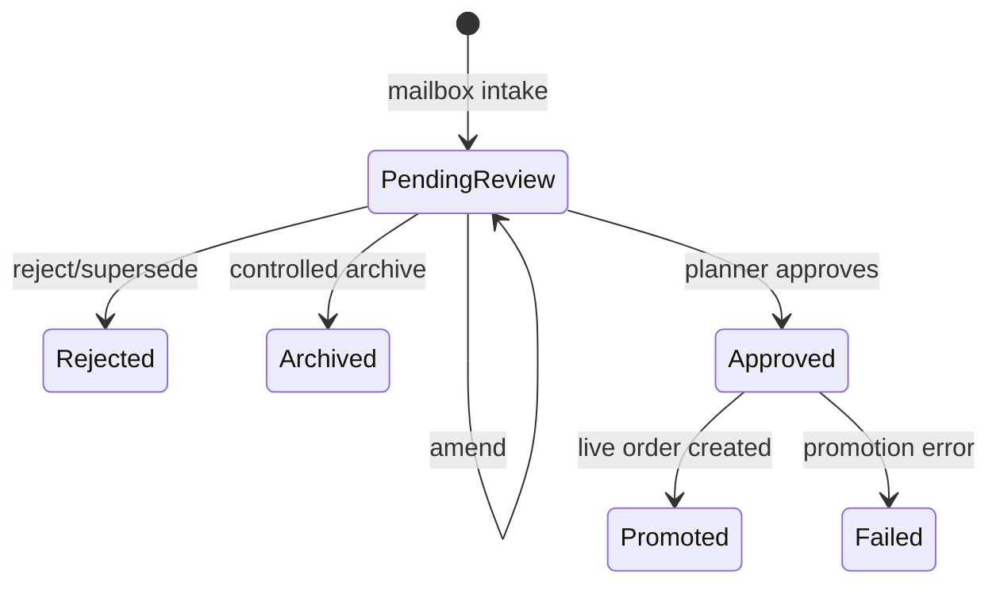

# Info mailbox order intake — production runbook

## Architecture and authority

`info@lyonshaulage.com -> Power Automate -> POST /api/v1/order-intake/email -> SQL staging/history -> TMS Order Review -> approval -> live order -> Planning Board`

The TMS is the only approval system and SQL is the authoritative operational history. There is no Microsoft List, SharePoint store, Power Automate Approval action, or direct live-order call. Automatic imports always start `PendingReview`. Rejected, failed, superseded and archived records remain in SQL. The original message and attachments remain unchanged in the Info mailbox and are addressable from the identifiers stored in every staged payload.

## Existing components reused

| Component | Production value |
|---|---|
| Shared mailbox | `info@lyonshaulage.com` |
| Trigger | Microsoft 365 Outlook |
| API connection | Existing SLH TMS custom connector with Entra OAuth |
| Intake | `IntakeInfoMailboxEmail` -> `POST /api/v1/order-intake/email` |
| Review | `PUT /staging/{id}/payload`, `POST .../approve`, `POST .../reject` |
| History/archive | `GET /staging/{id}/history`, `POST /staging/pending/archive` |
| SQL upgrade | `Database/031_Order_Import_Audit_History.sql` |

## Flow settings

- Name: `SLH-TMS | Info Mailbox | Order Intake | PROD`; solution-aware and initially stopped.
- Trigger concurrency 4; attachment-loop concurrency 1.
- Outlook and API retries: exponential, four, PT10S minimum and PT2M maximum.
- Secure outputs on attachment retrieval; secure inputs/outputs on TMS submission.
- Connections only `slh_sharedoffice365_info` and `slh_sharedslhtms_prod`.
- Environment variable `SLH_InfoMailboxUPN=info@lyonshaulage.com`.

## Complete action sequence

The deployable definition is `power-automate/info-mailbox-order-intake/workflow.json`.

### `When_New_Email_Arrives_Info_Shared_Mailbox`

Microsoft 365 Outlook — When a new email arrives in a shared mailbox (V2).

- Mailbox: `@parameters('SLH_InfoMailboxUPN')`; folder Inbox; importance Any.
- Only with attachments: No. Include attachments: No; retrieve content explicitly.
- Concurrency: On, degree 4.
- Captures Outlook and Internet Message IDs, conversation ID, sender, To, CC, subject, received time, body/body preview, importance and web link.
- Never move, mark read, categorise, delete or alter the source.

### `Scope_Receive_Source`

1. `Initialise_Correlation_Id` — Initialize String `varCorrelationId` = `@guid()`.
2. `Initialise_Attachment_Array` — after 1 succeeds, Initialize Array `varAttachments` = `[]`.
3. `Get_Attachment_List` — Outlook Get attachments (V2). Message ID `@triggerOutputs()?['body/id']`; mailbox parameter above; bounded retry.
4. `For_Each_Source_Attachment` — input `@coalesce(outputs('Get_Attachment_List')?['body/value'],json('[]'))`; concurrency 1.
5. `Get_Attachment_Content` — Outlook Get attachment (V2). Message ID from trigger, attachment ID `@items('For_Each_Source_Attachment')?['id']`, shared mailbox parameter; bounded retry; secure outputs.
6. `Append_Original_Attachment` — append this object to `varAttachments`:

```json
{
  "name": "@items('For_Each_Source_Attachment')?['name']",
  "contentType": "@coalesce(items('For_Each_Source_Attachment')?['contentType'],'application/octet-stream')",
  "contentBase64": "@outputs('Get_Attachment_Content')?['body/contentBytes']",
  "isInline": "@coalesce(items('For_Each_Source_Attachment')?['isInline'],false)",
  "contentId": "@items('For_Each_Source_Attachment')?['contentId']",
  "size": "@items('For_Each_Source_Attachment')?['size']"
}
```

Attachment bytes exist only in the secured actions/request. The API extracts supported Excel/XLSX/XLSM/CSV/PDF/body formats and stores source metadata and extracted payload in SQL; the mailbox copy remains the original evidence.

### `Scope_Submit_To_TMS`

Run after receive succeeds.

1. `POST_To_TMS_Staging` — existing custom connector operation `IntakeInfoMailboxEmail`; existing Entra OAuth and `Tms.Access`; bounded retry; secure inputs and outputs. Tracked properties contain only correlation and message IDs. Request body:

```json
{
  "messageId": "@triggerOutputs()?['body/id']",
  "internetMessageId": "@triggerOutputs()?['body/internetMessageId']",
  "conversationId": "@triggerOutputs()?['body/conversationId']",
  "mailbox": "@parameters('SLH_InfoMailboxUPN')",
  "senderAddress": "@triggerOutputs()?['body/from']",
  "senderName": "@triggerOutputs()?['body/fromName']",
  "toRecipients": "@triggerOutputs()?['body/toRecipients']",
  "ccRecipients": "@triggerOutputs()?['body/ccRecipients']",
  "subject": "@triggerOutputs()?['body/subject']",
  "receivedAtUtc": "@triggerOutputs()?['body/receivedDateTime']",
  "bodyText": "@triggerOutputs()?['body/bodyPreview']",
  "bodyHtml": "@triggerOutputs()?['body/body']",
  "bodyFormat": "html",
  "importance": "@triggerOutputs()?['body/importance']",
  "webLink": "@triggerOutputs()?['body/webLink']",
  "correlationId": "@variables('varCorrelationId')",
  "attachments": "@variables('varAttachments')"
}
```

The API performs format recognition, multi-order extraction, normalisation, master-data matching, validation, PO-first duplicate/amendment handling and staging. One email/attachment may produce many orders. A failed parsed order does not roll back valid rows. Deterministic message/source-row keys make retries idempotent; cross-message duplicates and amendments remain visible for review.

2. `Record_Import_Result` — Compose correlation ID, message ID, HTTP status and API result after success. It is diagnostic run metadata, not an order store.

### `Scope_Error_Handler`

Run after submit failed, timed out or skipped.

1. `Handle_Import_Exception` — Compose safe correlation/message identifiers and failure statement only; never attachment bytes, OAuth material or secrets.
2. `Terminate_Failed_Import` — after handler succeeds, terminate Failed with code `SLH_INFO_MAILBOX_IMPORT_FAILED`. Source remains untouched and replay is safe.

## SQL review, approval and history

`StagedImports` holds current state. Append-only `StagedImportEvents` snapshots the full payload at `Received`, `Amended`, `Approved`, `Rejected`, `Promoted`, `Failed`, `Superseded` and `Archived`, with previous/new status, reason, actor and UTC time. An amendment therefore never destroys the received payload.

`TransportOrders.SourceStagedImportId` links a promoted order to staging and all stored email/attachment identifiers. The legacy `DELETE /api/v1/staging/pending` route remains for compatibility but archives; it performs no SQL delete.



Valid unmatched/Wave 3 orders remain `PendingReview`; no flow action assigns a run. Pallets travel in the parsed payload to `TransportOrders.Pallets`. If a source count cannot be preserved, the parser must emit a warning/failure rather than inventing it.

The existing Azure SQL automated backup, daily/monthly export and restore-drill process protects this history. No parallel datastore is introduced.

## Deployment order

1. Deploy the API and verify `031_Order_Import_Audit_History.sql` applied.
2. Verify `StagedImportEvents` and `TransportOrders.SourceStagedImportId` in Azure SQL.
3. Deploy the matching TMS web change.
4. Import/update `workflow.json` in the existing managed solution.
5. Bind both existing connections and set the mailbox environment variable.
6. Keep stopped during acceptance testing; enable only after planner sign-off.

## Acceptance matrix

For every case capture flow run/correlation IDs, message IDs, attachment, staging IDs, status/history, extracted values, duplicate result and live-order existence.

| Test | Required result |
|---|---|
| Normal Excel | Correct sites/dates/pallets; PendingReview only |
| Body/HTML table | Extracted and source-linked |
| Multiple orders/attachments | One row per order; shared evidence; independent processing |
| Missing PO | Review exception retained, not discarded |
| Unknown customer/site | Original value and exception retained |
| Duplicate email replay | Existing deterministic records returned |
| Resent/amended order | Duplicate/amendment visible; both payload snapshots retained |
| Invalid date/extraction failure | Exception retained; other valid orders continue |
| Wave 1 | PendingReview until approval |
| Valid unmatched/Wave 3 | Retained; no incorrect run allocation |
| API unavailable | Four bounded retries; safe replay; no duplicate |
| Pallet regression, e.g. 26 | 26 at intake, staging, history and live order |
| Reject | SQL record/history/reason retained; no live order |
| Archive | SQL row count unchanged; Archived history exists |
| Approve | Approved then Promoted; one live order with source FK |
| Direct-live guard | Validator rejects any `/api/v1/orders` write |

Automated checks:

```bash
python power-automate/info-mailbox-order-intake/validate_workflow.py
python power-automate/info-mailbox-order-intake/test_validate_workflow.py
dotnet test Slh.Tms.Api.Tests/Slh.Tms.Api.Tests.csproj --filter FullyQualifiedName~StagingAuditHistoryTests
```

Enablement requires all representative formats, pallet continuity, replay/resent handling, source immutability, SQL history/source linkage and PendingReview behaviour to pass, with no List, SharePoint or Power Automate Approval action present.
